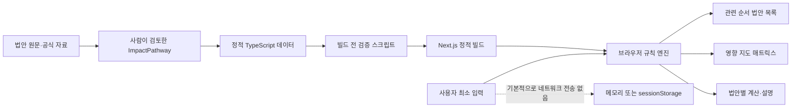

# 개인화 법안 관련성·영향 안내 기능 계획

> 문서 상태: 개정안 (v2)
> 최초 작성: 2026-08-17 · 개정: 2026-08-17
> 대상 프로젝트: 입법로그(Legislative Log)
> 구현 범위: GitHub Pages에서 동작하는 첫 번째 MVP
> 개정 요약: 판정 알고리즘·데이터 타입·집계 규칙을 구현 가능한 수준으로 확정했다. 변경 내역은 [부록 A](#부록-a-v1에서-바뀐-것)에 있다.

## 1. 문서 목적

이 문서는 사용자가 연령대, 경제활동 상태, 소득 구간, 가구 형태 등 최소한의 생활조건을 선택하면 다음 두 가지를 제공하는 기능의 제품·데이터·UI·검증 계획을 정의한다.

1. 사용자와 직접 연결되는 법안을 설명 가능한 기준으로 먼저 보여준다.
2. 별도 화면에서 선택한 조건을 기준으로 현재 법안들의 혜택 방향, 부담 방향, 상반된 영향, 직접 변화 없음, 자료 부족, 연결 없음을 비교한다.

이 기능은 정치적 성향이나 정당 선호를 추천하지 않는다. 법안이 개인의 경제·노동·주거·돌봄·서비스 이용·행정부담·권리에 어떤 경로로 연결되는지를 중립적으로 설명하는 것이 목적이다.

이 문서는 **구현 명세**다. §7·§9·§12에 적힌 규칙은 그대로 코드와 테스트가 되어야 하며, 애매하게 남겨 둔 부분이 있으면 그것은 결함으로 간주한다.

## 2. 핵심 결론

MVP는 하나의 `개인 영향 점수`를 만들지 않는다. 다음 항목을 서로 독립된 축으로 유지한다.

- **관련성**: 법안의 명시적 대상·부담자·이용자 조건과 사용자 입력이 얼마나 직접 연결되는가
- **영향 방향**: 현행 기준선과 비교할 때 어느 생활영역이 어떤 방향으로 바뀌는가
- **규모**: 금액·시간·자격 변화 등을 실제 단위로 얼마나 추정할 수 있는가
- **근거**: 법문, 공식 추계, 대표 미시자료, 인과연구, 정성적 영향경로 중 무엇을 사용했는가
- **불확실성**: 시행령, 법안 수정, 신청 여부, 가격 전가, 행동반응, 자료시차 등 무엇을 아직 모르는가
- **시점**: 현재 시행 중인 영향인지, 통과·시행을 전제로 한 조건부 영향인지

따라서 사용자에게 `이득 70%` 같은 숫자를 보여주지 않는다. 대표 미시자료와 검증된 모형 없이 만든 백분율은 개인의 이득 확률도, 비슷한 집단의 통계도 아니다.

## 3. 목표와 비목표

### 3.1 목표

- 사용자가 본인과 직접 연결되는 법안을 빠르게 찾는다.
- 각 법안이 왜 관련 있는지 입력조건과 법적·경제적 영향경로로 설명한다.
- 혜택과 부담이 동시에 존재하거나 시점에 따라 달라지는 법안을 그대로 `상반·시점별 다름`으로 보여준다.
- `연결 없음`, `직접 변화 없음`, `자료 부족`을 서로 다른 상태로 구분한다.
- 모든 개인화 결과에서 기준선, 법안 버전, 근거 출처, 검토일, 핵심 가정을 확인할 수 있게 한다.
- 개인 입력을 서버로 보내지 않고 GitHub Pages의 브라우저 안에서 처리한다.
- 같은 입력에 대해 언제나 같은 결과와 같은 순서를 낸다(결정론).

### 3.2 비목표

- 정당·후보·정치성향 추천
- 찬성 또는 반대 결론 제시
- 모든 생활영역을 임의 가중치로 합친 종합점수
- 법안 통과 가능성과 통과했을 때의 개인 영향을 하나의 숫자로 결합
- 대표자료 없이 `나와 비슷한 사람들의 이익 비율`을 추정
- 법률·세무·노무·재무 상담을 대체하는 확정 판정
- LLM이 자동 생성한 영향대상·방향을 사람 검토 없이 공개
- 사용자 계정, 서버 프로필 저장, 기기 간 동기화

## 4. 연구에서 가져온 설계 원칙

정책 분배영향분석과 규제영향평가의 공통 구조는 `기준선 → 영향경로 → 영향집단 → 방향·규모 → 불확실성 → 사후평가`다. 이 구조를 시민용 제품으로 번역한다.

### 4.1 기준선과 개정안을 분리한다

- 시행 전 법안: `현행법`과 `현재 공개된 법안 문안`을 비교한다.
- 시행 중 법률: 시행 전 기준과 현재 제도를 비교하고 실제 결과 추적을 별도로 둔다.
- 아직 효력이 없는 법안에는 항상 조건부 문구를 붙인다. 어떤 진행 단계에 어떤 시제를 쓰는지는 §5.5의 표로 고정한다.
- 법안의 통과 가능성은 개인 영향 계산과 결합하지 않는다.

### 4.2 관련성과 영향은 다른 질문이다

- 관련성이 높아도 영향 방향이나 규모를 모를 수 있다.
- 관련성이 낮아도 사회 전체에는 중요한 법안일 수 있다.
- `관련 순서`는 정보 탐색을 돕는 정렬이지 법안에 대한 지지 권고가 아니다.

### 4.3 정량화할 수 없으면 정성적으로 기권한다

- 법정 산식과 필요한 입력이 있으면 실제 단위로 계산한다.
- 공식·대표자료가 있으면 범위와 가정을 붙여 추정한다.
- 방향만 뒷받침되면 방향만 표시한다.
- 방향조차 뒷받침되지 않으면 `판단자료 부족`으로 남긴다.

### 4.4 법적 부담자와 경제적 부담자를 구분한다

사업주나 기업이 법적으로 납부하는 비용도 가격, 임금, 고용 또는 이윤을 통해 다른 집단으로 전가될 수 있다. 전가 근거가 없으면 개인의 직접 부담으로 단정하지 않는다.

**이 원칙은 데이터 구조로 강제한다.** 영향경로의 `relationship` 필드가 `self`·`household`가 아니면, 조건이 아무리 정확히 맞아도 관련성은 `간접 영향 가능`을 넘지 못한다(§7.3). 자연어 주의문구에 맡기지 않는다.

### 4.5 전망과 실제 결과를 덮어쓰지 않는다

기존 프로젝트의 예측 기록과 결과 추적 원칙을 유지한다. 시행 후 자료가 생기면 기존 전망을 삭제하거나 수정하지 않고 실제 결과와 나란히 비교한다.

### 4.6 모르는 것은 모르는 쪽으로 기울인다

삼값 논리에서 `unknown`은 언제나 **더 약한 판정** 쪽으로 작동한다. 필수조건의 `unknown`은 `직접 대상`을 `조건부 대상`으로 낮추고, 제외조건의 `unknown`도 마찬가지로 낮춘다(§7.2). 정보가 없다는 이유로 판정이 강해지는 경로는 하나도 없어야 하며, 이는 §17.1에서 불변식으로 검사한다.

## 5. 제품 용어와 상태 체계

### 5.1 관련성 상태

| 상태 | 판정 기준 | 사용자 문구 예시 |
|---|---|---|
| `직접 대상` | 본인·가구 경로의 필수 조건이 모두 일치하고 제외조건이 모두 부정 | 직장가입자이고 보험료율 변경 대상이어서 직접 관련됩니다. |
| `조건부 대상` | 본인·가구 경로에 모순은 없지만 필수정보나 제외조건 확인이 하나 이상 비어 있음 | 가입기간을 알면 직접 적용 여부를 더 정확히 확인할 수 있습니다. |
| `간접 영향 가능` | 고용주·소비자·공공 경로가 일치. 조건이 완전히 맞아도 이 상태를 넘지 않음 | 고용주 비용 변화가 임금이나 고용으로 전가될 가능성이 있으나 크기는 불확실합니다. |
| `판단 불가` | 법안 문안·시행령·수치가 불충분해 경로 자체를 판정할 수 없음 | 시행령의 적용범위가 정해지지 않아 아직 판정할 수 없습니다. |
| `개인화할 직접 근거 없음` | 일치하는 경로가 하나도 없음 | 개인 경제영향보다 제도 전반의 변화가 중심인 법안입니다. |

`개인화할 직접 근거 없음`은 법안이 중요하지 않다는 뜻이 아니다. 개인 생활조건으로 우선순위를 정할 근거가 없다는 뜻이다. UI 문구에서 이 점을 반드시 함께 적는다.

상태 간 강도 순서는 다음과 같이 고정한다. 법안 단위 집계(§7.4)와 정렬(§7.5)이 이 순서를 사용한다.

```
직접 대상 (4) > 조건부 대상 (3) > 간접 영향 가능 (2) > 판단 불가 (1) > 개인화할 직접 근거 없음 (0)
```

`판단 불가`가 `개인화할 직접 근거 없음`보다 높은 이유는 §4.6이다. "모른다"를 "없다"로 내려 보내지 않는다.

### 5.2 영향 방향 상태

영향 방향은 법안 전체에 바로 붙이지 않고 **생활영역별로** 판정한다.

| 상태 | 기호 | 의미 |
|---|---|---|
| `혜택 방향` | `+` | 현금 증가, 부담 감소, 권리·접근성 개선 등 긍정 경로가 확인됨 |
| `부담 방향` | `−` | 세금·보험료·가격·시간부담 증가, 권리·접근성 축소 등 부정 경로가 확인됨 |
| `상반·시점별 다름` | `±` | 같은 사용자에게 혜택과 부담이 함께 있거나 단기·장기 방향이 다름 |
| `확인된 직접 변화 없음` | `0` | 검토 범위 안에서 직접 변화가 없다는 **근거가 있음** |
| `판단자료 부족` | `?` | 방향이나 규모를 판정할 근거가 부족함 |
| `검토 대상 아님` | `·` | 이 법안에는 해당 생활영역 경로 자체가 없음 |

기호는 위 표에서 벗어나 쓰지 않는다. 모든 셀은 기호와 텍스트 레이블을 함께 노출하며, 색은 보조 수단으로만 쓴다(§17.3).

### 5.3 `영향이 작음` 사용 조건

MVP에서는 원칙적으로 `영향이 작음`을 사용하지 않는다. 향후 정량모형을 도입한 뒤 다음 조건을 모두 만족할 때만 `변화 미미`를 사용할 수 있다.

1. 비교 기준선이 명확하다.
2. 사전에 공개한 중요성 기준 `τ`가 있다.
3. 추정범위 전체가 `-τ`와 `+τ` 사이에 있다.
4. 그 기준이 모형 오차, 행정상 최소 단위 또는 외부 연구에 근거한다.

자료가 없다는 이유로 `변화 미미`를 부여하지 않는다.

### 5.4 근거 표현과 기존 표기 체계와의 관계

하나의 `신뢰도 82%` 대신 다음 네 항목을 따로 표시한다.

- **근거 방식**: 법문 산식 / 공식 추계 / 대표자료 모형 / 유사정책 인과연구 / 정성적 영향경로
- **사용자 적용성**: 조건 완전 일치 / 일부 일치 / 광범위 집단만 일치
- **방향 견고성**: 합리적 시나리오에서 유지 / 가정에 따라 전환
- **핵심 공백**: 시행령, 수급률, 전가율, 행동반응, 자료시차 등

정성적 확신 수준을 발생확률로 변환하지 않는다.

**기존 표기 체계와 충돌하지 않게 한다.** 프로젝트에는 이미 두 가지 표기가 있다.

- [`ClaimType`](../src/types/bill.ts) — 사실/공식 주장/해석/전망/의혹 (문장 단위, 원칙 3)
- [`EvidenceItem.certainty`](../src/types/bill.ts) — 높음/중간/낮음 3단 눈금. [`EvidenceList`](../src/components/EvidenceList.tsx)가 막대 그래프로 렌더한다.

개인화 레이어는 다음 규칙을 따른다.

1. **`certainty` 눈금을 개인화 레이어에 확장하지 않는다.** 3단 순서형 확신 눈금은 §5.4가 거부하는 단일 확신 지표에 해당한다. 개인화 결과에는 위의 네 항목만 쓴다.
2. **`evidenceMethod`는 `ClaimType`으로 결정론적으로 매핑한다.** 개인화 블록에서도 기존 `ClaimBadge`를 재사용해 표기 체계를 하나로 유지한다.

| `evidenceMethod` | 매핑되는 `ClaimType` | 근거 |
|---|---|---|
| `statutory_rule` | `fact` | 법 조문에서 직접 확인 가능 |
| `official_estimate` | `official_claim` | 정부·공공기관이 공식적으로 밝힌 추계 |
| `representative_model` | `interpretation` | 모형과 가정에 의존 |
| `causal_study` | `interpretation` | 외부 연구 결과의 이전 적용 |
| `qualitative_pathway` | `interpretation` | 제도 구조에 대한 해석 |

3. **한 화면에 두 표기가 겹쳐 보이지 않게 배치한다.** `certainty` 눈금은 기존 07 섹션(근거와 한계)에만 두고, 개인화 블록은 06 섹션 안에 둔다(§10.3).

시행 전 법안의 경로는 근거 방식과 무관하게 시제가 조건부다. 이는 `ClaimType`이 아니라 §5.5의 문구 규칙으로 처리한다.

### 5.5 법안 진행 단계별 문구 규칙

[`BillStatus`](../src/types/bill.ts)의 7개 값 전부에 대해 개인화 문구의 시제를 고정한다. 이 표가 없으면 `공포` 상태처럼 "통과했지만 아직 효력 없음"인 법안이 현재형으로 서술되는 사고가 난다.

| `status` | 시제 | 필수 문구 |
|---|---|---|
| `발의` | 조건부·미래 | 현재 문안대로 통과·시행되면 … / 심사 과정에서 내용이 바뀔 수 있습니다 |
| `심사중` | 조건부·미래 | 위와 동일 |
| `본회의_계류` | 조건부·미래 | 위와 동일 |
| `통과` | 조건부·시행 전 | 국회는 통과했지만 시행일 전이라 아직 적용되지 않습니다 |
| `공포` | 조건부·시행 전 | 공포됐지만 시행일(YYYY-MM-DD) 전까지는 적용되지 않습니다 |
| `시행` | 현재형 | 현재 적용되고 있습니다 |
| `폐기` | 과거·비적용 | 폐기되어 적용되지 않습니다. 기록으로만 남깁니다 |

`시행` 상태라도 **단계적으로 적용되는 조항**은 현재형을 그대로 쓰지 않는다. 경로의 `timeframe`과 `appliesFrom`을 함께 읽어 "2026년부터 적용, 2033년까지 단계 인상"처럼 적용 시점을 명시한다. 국민연금 보험료율이 여기 해당한다.

`효력 발생 여부`는 별도 데이터 필드로 두지 않고 `bill.status`와 `bill.effectiveDate`에서 파생한다. 파생 함수 `isInEffect(bill, asOf)`를 한 곳에 두고 UI·문구·정렬이 모두 그것만 쓴다.

## 6. 사용자 입력 설계

### 6.1 기본 입력

첫 화면에서는 네 가지 항목만 묻는다.

| 항목 | 입력 방식 | 설계 메모 |
|---|---|---|
| 연령구간 | 단일 선택 | 고정된 세대명이 아니라 실제 법적 경계에 맞춘 구간 사용 |
| 경제활동 상태 | 복수 선택(완결형) | 직장인, 자영업, 사업주, 구직, 비경제활동, 연금수급, `해당 없음` |
| 가구 구성 | 성인 수, 자녀 수·연령대 | 혼인 여부 자체보다 법적 계산에 필요한 가구단위 중심 |
| 가구 **세전** 연소득 구간 | 구간 선택 | `모름`과 `답하지 않음`을 항상 제공 |

**소득 질문은 세전 기준으로 묻는다.** v1에서는 `가구 처분가능소득 구간`을 물었으나, §8.1이 가처분소득을 `소득 + 현금급여 − 직접세 − 사회보험료`로 **계산해서 산출**하므로 같은 값을 입력으로도 받으면 순환이 생기고 세·보험료 변화를 이중으로 반영할 위험이 있다. 일반 이용자가 실제로 아는 값이 세전 연봉이나 월 실수령액이라는 점도 같은 방향을 가리킨다.

- 입력: 가구 세전 연소득 구간 (보조 선택지로 `월 실수령액 구간` 제공, 내부에서 세전 환산 범위로 변환하되 환산 불확실성 때문에 폭을 넓게 잡는다)
- 출력: 처분가능소득과 그 변화(ΔY)는 §8.1의 계산 결과로만 등장한다

소득 구간은 집단 비교와 질문 분기에만 사용한다. 세금·보험료·급여의 실제 산식 계산에는 해당 법률이 정의하는 과세소득, 기준소득월액, 재산 또는 보험료 정보 등을 별도로 받아야 한다.

**복수 선택 질문은 완결형으로 만든다.** `해당 없음` 선택지를 반드시 포함하고, 사용자가 무언가를 선택하면 선택하지 않은 항목은 `false`로 확정한다. 질문 자체를 건너뛰면 모든 항목이 `unknown`이다. 이 규칙이 없으면 `includes` 연산자가 "선택 안 함"과 "응답 안 함"을 구분하지 못한다.

### 6.2 구간 입력의 내부 표현

모든 수치성 입력은 **구간**으로 표현한다. 단일 값도 폭이 0인 구간으로 다룬다.

```ts
/** 양 끝을 포함하는 닫힌 구간. max가 없으면 상한 없음(예: 1억 원 이상). */
interface NumericRange {
  min: number;
  max: number | null;
}
```

이렇게 하는 이유는 §7.1의 삼값 평가와 직결된다. 사용자가 고른 밴드가 법정 경계를 **걸치면** `true`도 `false`도 아니라 `unknown`이어야 한다. 밴드를 문자열 코드로만 두면 이 판정 자체가 불가능하고, §17.1이 요구하는 경계값 테스트도 정의할 수 없다.

밴드 정의는 데이터가 아니라 **법정 경계에서 역산**해 만든다. 만 18세, 만 60세, 만 65세, 기준소득월액 상·하한처럼 실제 법이 쓰는 경계를 밴드 경계로 삼으면 `unknown`이 나오는 빈도가 크게 줄어든다.

### 6.3 법안별 추가 입력

관련성 판정에 꼭 필요한 경우에만 추가로 묻는다.

- 국민연금 가입유형, 수급 여부, 기준소득 정보
- 정규·비정규·하청·특수고용·플랫폼·고용주 등 노동관계
- 임차·자가 및 지역
- 해당 서비스의 현재 이용·신청 여부
- 상속 관련 법안의 경우 상속관계와 자산 구간

예를 들어 상속세 관련성을 현재 소득만으로 추정하지 않는다. 사용자가 해당 법안의 상세 결과를 보려 할 때 자산·상속관계를 선택적으로 묻는다.

추가 질문은 **판정을 바꿀 수 있을 때만** 노출한다. 어떤 답을 하든 결과가 같으면 묻지 않는다. 이 판단은 `whatWouldChange(pathway, profile)` 함수가 담당하며, §10.3의 "다른 답을 선택했을 때 달라지는 결정적 조건" 표시와 같은 계산을 공유한다.

### 6.4 수집하지 않을 정보

- 정당 또는 후보 지지
- 정치적 이념·정책 찬반
- 투표 이력
- 이름, 주민등록번호, 전화번호, 이메일
- 정확한 주소
- 법안 영향과 무관한 성별·건강·장애·종교 등 민감정보

민감정보가 법적 자격이나 차등영향 분석에 꼭 필요할 때도 선택사항으로 두고, 사용 목적을 해당 질문 바로 옆에서 설명한다.

## 7. 관련성 계산 방식

이 절은 그대로 구현·테스트되는 명세다. 각 규칙에는 §17.1의 테스트 항목이 대응한다.

### 7.1 삼값 조건 평가

모든 조건은 `true` / `false` / `unknown` 중 하나로 평가한다.

**범주형 조건** (`equals`, `oneOf`, `includes`)

| 사용자 상태 | 결과 |
|---|---|
| 질문에 응답했고 값이 조건을 만족 | `true` |
| 질문에 응답했고 값이 조건을 만족하지 않음 | `false` |
| `모름` 또는 `답하지 않음`을 선택했거나 질문을 건너뜀 | `unknown` |

**구간형 조건** (`withinRange`) — 사용자 구간 `U`와 조건 구간 `C`를 비교한다.

| 관계 | 결과 | 예 |
|---|---|---|
| `U ⊆ C` (완전 포함) | `true` | 사용자 30–39세, 조건 18–59세 |
| `U ∩ C = ∅` (완전 배제) | `false` | 사용자 30–39세, 조건 65세 이상 |
| 그 외 (경계를 걸침) | `unknown` | 사용자 55–64세, 조건 60세 미만 |

**걸침이 `unknown`이 되는 것이 이 설계의 핵심이다.** v1처럼 밴드에 `gte`/`lte`를 쓰면 걸침 케이스가 조용히 `true` 또는 `false`로 떨어져 경계 인근 사용자에게 오판을 내놓는다.

`unknown`이 나오면 UI는 그 조건을 "이걸 알려주시면 더 정확해집니다" 목록에 올린다. 사용자는 언제든 더 좁은 구간으로 답을 고쳐 `unknown`을 해소할 수 있다.

### 7.2 조건 역할과 경로 매칭

조건의 `role`은 세 가지이며, 각각의 의미를 명확히 고정한다. v1의 `supporting`은 알고리즘에서 쓰이지 않는 죽은 값이었으므로 `informative`로 바꾸고 역할을 부여했다.

| `role` | 의미 | 판정 영향 |
|---|---|---|
| `required` | 이 경로가 적용되기 위한 필수 조건 | 있음 |
| `excluding` | 하나라도 성립하면 이 경로가 적용되지 않는 조건 | 있음 |
| `informative` | 판정은 바꾸지 않지만 설명 문구와 규모 계산 입력에 필요한 조건 | 없음 (규모 계산 가능 여부에만 영향) |

경로 하나의 매칭 결과는 다음 순서로 구한다.

```text
function matchImpactPathway(pathway, profile) -> MatchResult

1. 경로가 undecidable 플래그를 갖고 있으면 (법안 문안·시행령 미확정)
       return UNDECIDABLE

2. 제외조건 평가
       하나라도 true      -> return EXCLUDED
       하나라도 unknown   -> excludeUncertain = true

3. 필수조건 평가
       하나라도 false     -> return NO_MATCH
       하나라도 unknown   -> match = PARTIAL
       전부 true          -> match = MATCHED

4. 제외조건 확인이 남아 있으면 강등
       if excludeUncertain and match == MATCHED:
           match = PARTIAL

5. return match
```

4단계가 v1에 없던 규칙이다. v1은 필수조건의 `unknown`만 강등하고 제외조건의 `unknown`은 무시해서, "제외 대상인지 아직 모르는 사람"이 `직접 대상`으로 판정되는 과대판정 비대칭이 있었다.

### 7.3 매칭 결과와 관계 유형의 결합

관련성은 **매칭 결과 × 관계 유형**의 2차원 함수다. v1은 `간접 영향 가능`을 조건 매칭 실패 시의 후순위 분기로 두었는데, 그러면 "고용주 비용 증가 → 임금 전가" 경로에서 사용자가 직장인이라는 조건이 전부 맞을 때 `직접 대상`이 나온다. §4.4를 스스로 위반하는 판정이었다.

| 매칭 결과 ＼ `relationship` | `self`, `household` | `employer`, `consumer`, `public` |
|---|---|---|
| `MATCHED` | **직접 대상** | **간접 영향 가능** |
| `PARTIAL` | **조건부 대상** | **간접 영향 가능** |
| `UNDECIDABLE` | **판단 불가** | **판단 불가** |
| `EXCLUDED`, `NO_MATCH` | 경로 제외 | 경로 제외 |

핵심 불변식: **`relationship`이 `self`·`household`가 아닌 경로는 조건이 완전히 일치해도 `간접 영향 가능`을 넘지 못한다.** 사용자 본인이 사업주여서 비용을 직접 부담하는 경우는 `relationship: "self"`인 별도 경로로 작성한다. 즉 같은 법안·같은 조항이라도 "내가 사업주로서 내는 돈"과 "내 고용주가 내는 돈이 나에게 전가되는 것"은 반드시 다른 경로다.

### 7.4 법안 단위 집계

하나의 법안에는 여러 영향경로가 있다. 법안 단위 관련성은 다음 전함수(total function)로 구한다.

```text
function summarizeBillRelevance(pathways, profile) -> Relevance

matched = pathways where matchImpactPathway(...) in {MATCHED, PARTIAL}
undecidable = pathways where matchImpactPathway(...) == UNDECIDABLE

if matched is not empty:
    return max(관련성 강도)  over matched      # §5.1의 4 > 3 > 2 순서
if undecidable is not empty:
    return 판단 불가
return 개인화할 직접 근거 없음
```

- 영향 방향은 집계하지 않고 **모든 일치 경로를 그대로 보존**한다.
- 혜택과 부담 경로가 함께 있으면 법안 요약 방향은 `상반·시점별 다름`이다.
- 법안 전체 요약과 생활영역별 상세를 모두 제공한다.
- `판단 불가` 경로는 매칭 경로가 있더라도 사라지지 않는다. 상세화면에 "아직 판정할 수 없는 경로 n건"으로 별도 표기한다.

### 7.5 기본 정렬

임의 가중치 합산 대신 다음 사전순 규칙을 사용한다.

```text
1. 관련성 강도          (직접 4 > 조건부 3 > 간접 2 > 판단 불가 1 > 없음 0)
2. 필수 조건 완전성      (unknown 개수 오름차순)
3. 현재 효력·시행 임박성  (시행 중 > 시행 임박 > 심사 중 > 폐기)
4. 근거 방식            (법문 산식 > 공식 추계 > 대표자료 모형 > 인과연구 > 정성 경로)
5. 법안·분석 갱신일      (내림차순)
6. slug 사전순          ← 최종 타이브레이커
```

6번이 v1에 없던 항목이다. **현재 5개 법안 중 4개가 `lastUpdated: "2026-08-16"`으로 동일**하므로 5번까지로는 순서가 확정되지 않는다. 결정론(§3.1, §18 단계 1 완료조건)을 만족하려면 값 기반 최종 타이브레이커가 반드시 필요하다. 배열 초기 순서에 의존하는 안정 정렬은 데이터 파일 순서가 바뀌면 결과가 달라지므로 근거로 삼지 않는다.

금액 크기로 서로 다른 생활영역을 정렬하지 않는다. 사용자가 원하면 `현재 시행 중`, `금전 영향 계산 가능` 등의 명시적 필터를 제공한다.

### 7.6 설명 가능성

각 결과는 다음 다섯 항목을 반환해야 한다.

1. 일치한 사용자 조건
2. 연결된 영향경로와 그 관계 유형(본인/가구/고용주/소비자/공공)
3. 아직 필요한 조건 (`unknown`인 필수·제외 조건)
4. 판정에 사용한 법안 조항과 근거
5. 다른 답을 골랐을 때 판정이 바뀌는 결정적 조건

내부 정렬값이 있더라도 사용자에게 확률이나 영향점수처럼 표시하지 않는다.

## 8. 영향 계산 방식

### 8.1 금전 영향

법정 산식이 있는 조세·현금급여·본인부담 사회보험료에는 다음 기준을 사용한다.

```text
가구 가처분소득 = 근로·사업소득 + 현금급여 - 직접세 - 본인부담 사회보험료
ΔY = 개정안 적용 가처분소득 - 현행법 적용 가처분소득
```

입력은 §6.1대로 **세전** 소득이며, 가처분소득은 이 식의 산출물이다. 사용자에게 가처분소득을 묻지 않는다.

결과에는 다음을 함께 표시한다.

- 월 또는 연간 원화 변화
- 세금·급여·보험료 등 원인 항목별 변화
- 적용연도
- 명목·실질 기준
- 단일값 또는 시나리오 범위
- 행동변화 포함 여부
- 계산에서 제외한 항목

사용자가 세전 소득을 구간으로 답했으면 결과도 **구간으로** 낸다. 구간 입력에서 점추정을 내놓지 않는다. 구간 폭이 너무 넓어 방향조차 갈리면 금액을 표시하지 않고 `판단자료 부족`으로 되돌린다.

가구 간 비교가 필요한 경우 원화와 함께 균등화 처분가능소득 대비 변화율을 보조적으로 제공할 수 있다. 이 값은 집단 비교용이며 법적 자격판정 기준을 대신하지 않는다.

### 8.2 비금전 영향

다음 생활영역을 분리해서 유지한다. 이 목록이 `ImpactDomain`의 정의이자 §10.2 매트릭스의 열이다.

| `ImpactDomain` | 한국어 레이블 |
|---|---|
| `disposable_income` | 가처분소득 |
| `tax` | 세금 |
| `social_insurance` | 사회보험료 |
| `living_cost` | 생활비·주거비 |
| `employment` | 고용·임금·근로조건 |
| `service_access` | 공공서비스·지원 자격 |
| `care_education_health` | 돌봄·교육·건강 |
| `administrative_time` | 신청·행정 부담 |
| `rights_risk` | 권리·법적 보호 |

비금전 영향을 임의의 원화나 가중점수로 바꾸지 않는다.

매트릭스 열이 9개면 모바일은 물론 데스크톱에서도 넓다. §10.2는 기본 5개 열(소득·고용·서비스·시간·권리)로 묶어 보여주고 펼치기로 9개 전체를 노출한다. 묶음 매핑은 고정 상수로 둔다.

### 8.3 시간축

현재 비용과 미래 혜택은 각각 표시한다. 예를 들어 보험료 부담 증가와 미래 연금급여 방향은 하나의 순이익으로 즉시 합치지 않는다. 합치려면 기대수명, 임금경로, 수익률, 할인율 등 별도 가정이 필요하기 때문이다.

`timeframe`이 다른 경로가 같은 셀에 모이면 그 셀은 `±`(상반·시점별 다름)이며, 상세에서 "지금은 부담, 장기적으로는 혜택 방향"처럼 시점을 나눠 서술한다.

## 9. `내 조건 기준 영향 지도` 설계

### 9.1 MVP의 표현 범위

대표 미시자료가 없는 MVP에서는 탭 이름을 `나와 비슷한 사람` 대신 **`내 조건 기준 영향 지도`**로 사용한다.

이 화면은 사용자의 선택조건과 연결된 법안 경로를 집계하는 것이며, 실제 유사집단 모집단을 추정하는 화면이 아니다.

### 9.2 요약 집계 — 6개 범주의 완전 분할

추적 중인 모든 법안을 다음 **여섯** 범주로 집계한다. v1은 다섯 범주였는데, 관련성 축의 `개인화할 직접 근거 없음`과 `판단 불가`를 담을 자리가 없어 합이 N이 되지 않았다. 이를 `확인된 직접 변화 없음`에 밀어 넣으면 §20이 스스로 경고한 "자료 부족을 무영향으로 오해"를 제품이 저지르게 된다.

| 범주 | 판정 기준 |
|---|---|
| 혜택 방향 | 일치 경로가 있고, 방향이 모두 `benefit` |
| 부담 방향 | 일치 경로가 있고, 방향이 모두 `burden` |
| 상반·시점별 다름 | `benefit`과 `burden`이 공존하거나 `mixed` 경로가 있음 |
| 확인된 직접 변화 없음 | 일치 경로가 있고, 방향이 모두 `no_direct_change` |
| 판단자료 부족 | 일치 경로의 방향이 `unknown`뿐이거나, 법안 관련성이 `판단 불가` |
| 내 조건과 연결 없음 | 법안 관련성이 `개인화할 직접 근거 없음` |

이 여섯은 상호배타적이고 전수적이다. 즉 임의의 프로필에 대해

```text
Σ(6개 범주 건수) == 전체 법안 수 N
```

이 항상 성립해야 하며, §17.1에서 속성 기반 테스트로 강제한다. 화면에는 항상 `전체 N건 중`이라는 분모를 표시하고, 자료 부족 법안을 분모에서 제외하지 않는다.

### 9.3 매트릭스 셀 판정 규칙

셀 하나는 `(법안, 생활영역)` 쌍이며, 그 쌍에 해당하는 **일치 경로들**로부터 다음 규칙으로 결정한다.

```text
function cellState(bill, domain, profile) -> CellState

paths = 일치 경로 중 pathway.domain == domain 인 것

if paths is empty:                       return 검토 대상 아님 (·)

directions = 방향이 unknown이 아닌 paths의 방향 집합
if directions is empty:                  return 판단자료 부족 (?)
if directions == {benefit}:              return 혜택 방향 (+)
if directions == {burden}:               return 부담 방향 (−)
if directions == {no_direct_change}:     return 확인된 직접 변화 없음 (0)
otherwise:                               return 상반·시점별 다름 (±)
```

방향이 확인된 경로가 하나라도 있으면 그 방향으로 판정하고, 남은 `unknown` 경로는 셀을 흐리지 않고 **셀 상세에 "방향 미확정 경로 n건"으로 별도 표기**한다. 이렇게 하지 않으면 근거가 하나 늘 때마다 셀이 `?`로 후퇴하는 이상한 동작이 나온다.

이 규칙이 성립하려면 **경로 하나가 생활영역 하나만 가져야 한다**(§12.2). v1처럼 `domains` 배열이면 한 경로의 단일 `direction`이 여러 영역에 강제 복사되어 §5.2의 "영역별 판정"이 무너진다.

### 9.4 향후 유사집단 통계의 요건

대표 가구 미시자료와 조사 가중치가 확보된 이후에만 다음과 같은 집단 비율을 제공할 수 있다.

```text
집단 이익비율 = Σ(조사가중치 × 이익 기준 충족 여부) / Σ(조사가중치)
```

필수 공개 항목은 다음과 같다.

- 유사집단의 정확한 정의
- 분석 기준선과 정책 시나리오
- 사용한 대표자료와 자료연도
- 원표본수와 유효표본수
- 조사 가중치
- 이익·부담·변화 미미 기준
- 가중 중앙값과 25~75% 또는 10~90% 범위
- 표본오차 또는 신뢰구간
- 제외된 영향영역과 핵심 가정

이때도 결과를 `당신이 이득 볼 확률`이라고 부르지 않는다. `정의된 집단에서 모형상 이익 기준을 넘은 가구의 가중 비율`이라고 표현한다.

교차집단 표본이 작으면 집단을 넓히고 어떤 조건을 제외했는지 알리거나 결과 산출을 중단한다. 사이트 이용자 입력은 자기선택 편향이 있으므로 모집단 통계에 사용하지 않는다.

## 10. 화면 구성

### 10.1 법안 목록 탭

기존 [`BillBrowser`](../src/components/BillBrowser.tsx)에 다음을 추가한다.

```text
┌ 내 조건에 맞춰 보기 ──────────────────────────┐
│ 30대 · 직장가입자 · 성인 2명/자녀 1명 · 소득구간 │
│ [조건 수정] [개인화 끄기]                        │
└───────────────────────────────────────────────┘

[직접 대상] 국민연금 개혁
왜 관련 있나: 직장가입자 보험료율 변경 대상 (본인 경로)
지금 부담: 보험료 증가 · 법문 산식
미래 영향: 급여 방향은 증가 · 개인 규모는 판단자료 부족
더 알려주시면: 가입기간
상태: 시행 중 · 2026-08-17 검토
```

카드 필수 요소는 다음과 같다.

- 관련성 상태
- 한 문장의 관련 이유와 **관계 유형**(본인/가구/고용주/소비자/공공)
- 생활영역별 영향 방향
- 현재 영향과 미래 영향
- 법안 진행 단계와 §5.5의 시제 문구
- 근거 방식과 미확인 조건
- 상세화면 링크

`추천`이라는 표현은 사용하지 않고 `관련 순서` 또는 `내 조건에 맞춘 정렬`을 사용한다.

기존 필터(진행 단계·분야·검색)와 개인화 정렬은 **직교**한다. 개인화를 켜도 필터는 그대로 작동하며, 정렬 기준만 §7.5로 바뀐다. 필터 결과가 0건일 때의 빈 상태 문구는 기존 것을 재사용한다.

### 10.2 영향 지도 탭

```text
[법안 목록] [내 조건 기준 영향 지도]

사용한 조건: 30대 · 직장인 · 3인 가구 · 세전소득 구간
빠진 조건: 가입기간, 주거형태

전체 5건 = 혜택 0 · 부담 0 · 상반 1 · 변화 없음 0 · 자료 부족 2 · 연결 없음 2

              소득  고용  서비스  시간  권리
국민연금        ±     ·      ·      ·     ·
노란봉투법      ?     ±      ·      ±     +
상속세          ?     ·      ·      ·     ·
검찰개혁        ·     ·      ·      ·     ?
국회법          ·     ·      ·      ·     ·

기호를 선택하면 영향경로·출처·가정·불확실성 표시
```

행은 법안, 열은 생활영역으로 둔다. 각 셀은 §5.2의 기호와 텍스트 레이블을 함께 사용하며, 색은 보조 수단이다. `−/+`처럼 표에 없는 기호는 쓰지 않는다.

요약 줄은 §9.2의 여섯 범주를 모두 보여주고 합이 N임을 눈으로 확인할 수 있게 한다.

### 10.3 법안 상세화면

**목차 구조를 건드리지 않는다.** [`BILL_SECTIONS`](../src/lib/sections.ts)는 10단계 + 출처로 고정된 배열이고, [`TableOfContents`](../src/components/TableOfContents.tsx)와 `ReadingProgress`가 이 배열의 길이와 인덱스로 진행률을 계산한다. 개인화 블록은 개인화 on/off에 따라 존재 여부가 달라지는 클라이언트 컴포넌트이므로, 이것을 독립 섹션으로 추가하면 목차 항목 수와 진행률이 사용자 상태에 따라 흔들린다.

따라서 개인화 블록은 **06 섹션(`stakeholders`, "누가 이득을 보고, 누가 부담을 지나") 내부의 첫 번째 서브블록**으로 배치한다. 기존 `StakeholderGrid` 바로 위에 온다. 목차는 불변이다.

> v1은 이 섹션을 "수혜자와 비용 부담자"로 지칭했으나, 실제 섹션 제목은 "누가 이득을 보고, 누가 부담을 지나"(목차 이름 "이득과 부담")다.

블록 구성:

- 일치한 조건과 관계 유형
- 직접·간접 영향경로 (관계 유형별로 시각적으로 분리)
- 현재 문안 또는 시행법 기준 + §5.5 시제 문구
- 계산 가능한 금액과 제외 항목
- 다른 답을 선택했을 때 달라지는 결정적 조건
- 원문 조항과 근거 링크

개인화를 켜지 않았을 때는 이 블록 자리에 "내 조건으로 보기" 안내 한 줄만 둔다. 블록 유무로 인한 레이아웃 점프를 줄이기 위해 자리를 미리 확보한다.

## 11. 시각화 선택

| 방식 | 장점 | 한계 | 결정 |
|---|---|---|---|
| 영향 근거 카드 | 이유·방향·시점·근거·공백을 함께 설명하기 좋음 | 전체 패턴 비교에는 약함 | 목록 기본형으로 사용 |
| 법안 × 생활영역 매트릭스 | 이질적인 법안들의 영향경로를 빠르게 비교 | 모바일에서는 카드로 재배치 필요 | 영향 지도 기본형으로 사용 |
| 0 중심 범위선 | 금전 영향의 방향과 불확실성 범위를 동시에 표시 | 검증된 정량모형이 있는 경우만 가능 | 단계 3에서 선택적 사용 |
| 파이·도넛 차트 | 완전한 하나의 총합은 간단히 표현 | 혼합·자료 부족·비교 불가능한 영역을 숨김 | 사용하지 않음 |
| 분위수 점 분포 | 실제 집단 분포를 비교하기 좋음 | 대표 미시자료와 가중치가 필요 | 단계 4로 보류 |

불확실성이 결과 해석을 바꿀 정도이면 범위선이나 시나리오를 표시한다. 불확실성이 너무 커 비교 자체가 무의미하면 차트를 만들지 않고 `판단자료 부족`으로 설명한다.

## 12. 데이터 모델 계획

### 12.1 현재 구조와의 관계

현재 [`Bill`](../src/types/bill.ts) 타입의 `beneficiaries`·`costBearers`는 `StakeholderEntry { who, how, scale?, claimType, source? }`로 이미 필드가 분해돼 있고 주장 유형과 출처도 붙어 있다. 완전한 자유문장은 아니다. 다만 `who`와 `how`의 **값**이 자연어라 사용자 입력과 기계적으로 대조할 수는 없다.

따라서 기존 필드를 그대로 두고 **별도의 구조화된 개인화 레이어**를 추가하되, 두 레이어가 서로 다른 말을 하지 않도록 링크와 검증을 건다(§12.4).

### 12.2 제안 타입

```ts
type ProfileKey =
  | "ageBand"
  | "economicRoles"
  | "householdAdults"
  | "childAgeBands"
  | "householdGrossIncomeBand"   // 세전 기준 (v1의 처분가능소득에서 변경)
  | "pensionStatus"
  | "employmentRelation"
  | "housingStatus"
  | "region"
  | "inheritanceSituation";

type ConditionOperator =
  | "equals"        // 범주형 단일 일치
  | "oneOf"         // 범주형 다중 후보
  | "includes"      // 복수선택 항목 포함 (완결형 질문 전제)
  | "withinRange";  // 구간 대 구간 비교 — gte/lte를 대체한다

interface NumericRange {
  min: number;
  max: number | null;   // null = 상한 없음
}

interface ProfileCondition {
  field: ProfileKey;
  operator: ConditionOperator;
  /** withinRange이면 NumericRange, 그 외에는 범주값 */
  value: string | string[] | NumericRange;
  role: "required" | "excluding" | "informative";
  explanation: string;
}

type ImpactDomain =
  | "disposable_income"
  | "tax"
  | "social_insurance"
  | "living_cost"
  | "employment"
  | "service_access"
  | "care_education_health"
  | "administrative_time"
  | "rights_risk";

type ImpactDirection =
  | "benefit"
  | "burden"
  | "mixed"
  | "no_direct_change"
  | "unknown";

/** self·household만 '직접'으로 판정될 수 있다. §7.3 */
type ImpactRelationship =
  | "self"
  | "household"
  | "employer"
  | "consumer"
  | "public";

interface ImpactPathway {
  id: string;
  billSlug: string;              // 소속 법안. 검증 스크립트가 실재 여부를 확인한다
  title: string;
  relationship: ImpactRelationship;
  conditions: ProfileCondition[];

  /** 생활영역은 정확히 하나. 여러 영역에 걸치면 경로를 나눈다. §9.3 */
  domain: ImpactDomain;
  direction: ImpactDirection;

  timeframe: "current" | "short_term" | "long_term";
  /** 이 경로가 실제로 적용되기 시작하는 시점 (단계 시행 대응). §5.5 */
  appliesFrom?: string;

  /** 법안 문안·시행령이 미확정이라 판정 자체가 불가능한 경로 */
  undecidable?: { reason: string };

  baseline: string;
  /** 비교 대상 기준선의 버전 식별자. 이 값이 바뀌면 재검토 대상이다 */
  baselineVersion: string;
  mechanism: string;

  magnitude?: {
    kind: "statutory_calculation" | "model_range" | "qualitative_only";
    /** kind가 statutory_calculation이면 필수 */
    calculatorId?: string;
    /** 실제 측정 단위만 온다. 'eligibility'처럼 단위가 아닌 값은 두지 않는다 */
    unit?: "KRW_month" | "KRW_year" | "hours_year";
    /** 자격 변화처럼 단위가 없는 결과는 이쪽에 서술한다 */
    eligibilityChange?: string;
  };

  evidenceMethod:
    | "statutory_rule"
    | "official_estimate"
    | "representative_model"
    | "causal_study"
    | "qualitative_pathway";

  assumptions: string[];
  uncertainties: string[];
  legalBasis: Source[];          // 기존 Source 타입 재사용. 최소 1건
  reviewedAt: string;
}
```

`Source`는 [`src/types/bill.ts`](../src/types/bill.ts)의 기존 타입을 그대로 쓴다. 새 출처 타입을 만들지 않는다.

`ClaimType`은 `evidenceMethod`에서 §5.4의 표로 파생하므로 별도 필드를 두지 않는다. 같은 정보를 두 곳에 적으면 어긋난다.

### 12.3 데이터 배치

```text
src/data/bills/<slug>.ts      기존 법안 본문 (변경 없음)
src/data/impact/<slug>.ts     ImpactPathway[] (신규)
src/data/impact/index.ts      슬러그 → 경로 배열 매핑
```

기존 법안 파일을 건드리지 않으므로 개인화 레이어 없이도 사이트가 그대로 동작하고, 검증 스크립트가 개인화 레이어만 따로 검사할 수 있다.

### 12.4 데이터 규칙과 빌드 검증

아래 규칙은 문서상의 약속이 아니라 **빌드 전에 실행되는 검증 스크립트**로 강제한다. 정적 사이트라 데이터가 곧 코드이므로, 런타임 테스트보다 빌드 차단이 맞는 자리다.

`npm run validate:impact` (그리고 `prebuild`로 연결)

| # | 규칙 | 위반 시 |
|---|---|---|
| 1 | 모든 경로에 `legalBasis` 1건 이상, 각 출처에 `url` 또는 `publisher`+`date` | 실패 |
| 2 | `reviewedAt`이 존재하고 미래 날짜가 아님 | 실패 |
| 3 | `billSlug`가 실재하는 법안과 일치 | 실패 |
| 4 | `baselineVersion` 존재 | 실패 |
| 5 | `direction: "no_direct_change"`인데 `legalBasis`가 형식적임 | 실패 |
| 6 | `magnitude.kind === "statutory_calculation"`인데 `calculatorId` 없음 | 실패 |
| 7 | 조건의 `field`가 `ProfileKey`에 존재하고, `withinRange`의 구간이 `min ≤ max` | 실패 |
| 8 | `bill.status`가 마지막 `reviewedAt` 이후 바뀌었음 | 실패 |
| 9 | `bill.lastUpdated > reviewedAt` (법안 본문은 갱신됐는데 경로는 미검토) | 경고 |
| 10 | `benefit`/`burden` 경로가 있는데 대응하는 `StakeholderEntry`에 `pathwayId` 링크 없음 | 경고 |
| 11 | 같은 법안에 `relationship: "employer"` 경로만 있고 `self` 경로가 없음 | 경고 (귀착 검토 누락 가능성) |

10번을 위해 `StakeholderEntry`에 선택적 `pathwayId?: string`을 추가한다. 이 한 필드가 자유문장 요약과 구조화 레이어의 드리프트를 잡는다. 필수가 아니므로 기존 5개 법안 데이터는 수정 없이 통과한다.

그 밖의 편집 규칙:

- `benefit`과 `burden`은 주장 주체의 표현이 아니라 기준선 대비 작동방식으로 판정한다.
- `no_direct_change`는 검토 근거가 있을 때만 사용한다.
- 법안 문안이나 시행령이 바뀌면 `reviewedAt`과 `baselineVersion`을 함께 갱신한다.
- 동일한 법안에서도 사용자 역할에 따라 별도 경로를 만든다. 특히 "본인이 사업주"와 "고용주로부터의 전가"는 반드시 다른 경로다(§7.3).
- 출처 없는 LLM 추출 결과는 초안으로만 저장하고 공개 데이터에 포함하지 않는다.

## 13. GitHub Pages MVP 아키텍처

현재 프로젝트는 [`next.config.ts`](../next.config.ts)의 `output: "export"`와 [GitHub Pages 배포 워크플로](../.github/workflows/deploy-pages.yml)를 사용한다. 서버 없이 다음 구조로 구현할 수 있다.



### 13.1 클라이언트 구성요소

| 이름 | 역할 | 종류 |
|---|---|---|
| `PersonalProfileForm` | 기본·조건부 질문 | 클라이언트 |
| `ProfileSummary` | 현재 사용조건과 빠진 조건 | 클라이언트 |
| `evaluateCondition` | 삼값 조건 평가 (§7.1) | 순수함수 |
| `matchImpactPathway` | 경로 단위 매칭 (§7.2) | 순수함수 |
| `resolveRelevance` | 매칭 × 관계 유형 (§7.3) | 순수함수 |
| `summarizeBillRelevance` | 법안 단위 집계 (§7.4) | 순수함수 |
| `cellState` | 매트릭스 셀 판정 (§9.3) | 순수함수 |
| `partitionBills` | 6범주 분할 (§9.2) | 순수함수 |
| `sortByRelevance` | 결정론적 정렬 (§7.5) | 순수함수 |
| `whatWouldChange` | 결정적 조건 산출 (§6.3, §7.6) | 순수함수 |
| `PersonalizedBillBrowser` | 기존 목록 필터와 관련순서 결합 | 클라이언트 |
| `ImpactMap` | 건수 요약과 생활영역 매트릭스 | 클라이언트 |
| `ImpactReason` | 관련 이유, 근거, 가정, 공백 표시 | 클라이언트 |

순수함수는 React·DOM·전역 상태에 의존하지 않게 유지한다. 그래야 UI 없이 테스트할 수 있고, 단계 0의 완료조건(§18)이 성립한다.

### 13.2 정적 export 환경에서의 상태 처리

`output: "export"`이므로 첫 HTML은 프로필이 없는 상태로 프리렌더된다. 이를 무시하고 렌더 중에 `sessionStorage`를 읽으면 하이드레이션 불일치가 난다.

규칙:

1. **첫 페인트는 언제나 비개인화 상태**다. 서버 프리렌더 결과와 동일하다.
2. 저장된 프로필 복원은 `useEffect` 안에서만 한다.
3. 복원으로 목록 순서가 바뀌면 `aria-live="polite"` 영역에 "내 조건에 맞춰 N건을 다시 정렬했습니다"를 알린다. 스크린리더 사용자에게 순서 변경이 침묵으로 지나가지 않게 한다.
4. 개인화 배지·블록 자리는 비개인화 상태에서도 최소 높이를 확보해 레이아웃 점프를 줄인다.
5. `prefers-reduced-motion`이면 재정렬 전환 애니메이션을 쓰지 않는다.

### 13.3 저장 방식

- 기본: 컴포넌트 상태 또는 `sessionStorage`
- 선택사항: 사용자가 `이 기기에 기억`을 명시적으로 켤 때만 `localStorage`
- 제공: `내 정보 지우기` 버튼 (두 저장소 모두 삭제)
- 금지: URL 쿼리, 분석 이벤트, 외부 API에 프로필 값 포함

URL 쿼리 금지는 특히 중요하다. 프로필 값이 링크에 실리면 공유·리퍼러를 통해 정치적 성향을 추론할 수 있는 정보가 밖으로 나간다.

### 13.4 향후 대표자료 연동

원시 미시자료를 정적 사이트에 배포하지 않는다. 별도의 안전한 분석환경에서 집단별 결과를 사전 계산하고, 작은 셀을 억제한 집계 JSON만 GitHub Pages에 포함한다.

## 14. 개인정보·중립성 원칙

### 14.1 개인정보

- 목적에 필요한 최소 항목만 묻는다.
- 각 질문 바로 옆에 필요한 이유를 설명한다.
- 모든 질문에서 가능한 경우 `모름` 또는 `답하지 않음`을 제공한다.
- 기본적으로 브라우저 세션이 끝나면 입력이 사라진다.
- 사용자 입력을 사이트 운영자의 데이터셋이나 유사집단 통계로 재사용하지 않는다.

### 14.2 정치적 중립성

기존 [소개 페이지의 일곱 가지 원칙](../src/app/about/page.tsx) 중 1번("정당이 아니라 법안을 봅니다")과 3번("사실과 의견을 섞지 않습니다")을 개인화 기능에서도 그대로 지킨다.

- 발의자·정당·찬반 입장은 관련성 계산에 사용하지 않는다.
- 추진 측과 반대 측의 주장을 개인 영향의 확정 근거로 사용하지 않는다.
- 동일한 수준의 근거에는 동일한 표현과 시각 규칙을 적용한다.
- `추천`, `좋은 법안`, `나쁜 법안` 대신 `관련`, `혜택 방향`, `부담 방향`, `판단자료 부족`을 사용한다.
- 사용자가 어떤 답을 선택해도 정치적 메시지나 참여 유도가 달라지지 않는다.

### 14.3 고지

개인화 화면에는 다음을 상시 노출한다. 비목표(§3.2)에만 적어 두고 화면에 띄우지 않으면 지켜지지 않는다.

- 이 결과는 법률·세무·노무·재무 상담을 대체하지 않는다.
- 판정은 공개된 법안 문안과 검토일 기준이며, 시행령·법안 수정으로 바뀔 수 있다.
- 실제 자격 판정은 관계 기관의 기준을 따른다.

## 15. 현재 5개 법안의 초기 편집 범위

아래는 [`src/data/bills/index.ts`](../src/data/bills/index.ts)에 등록된 현재 콘텐츠를 기준으로 한 초기 영향경로 후보다. 출시 전 원문과 최신 상태를 다시 검증해야 한다.

| 법안 | `status` | 초기 영향경로 후보 | MVP 처리 원칙 |
|---|---|---|---|
| 국민연금 개혁 | `시행` | 직장가입자(self), 지역가입자(self), 사업주 부담분(employer), 현재·미래 수급자(self) | 현재 보험료(`social_insurance`)와 미래 급여(`disposable_income`)를 **다른 경로**로 분리. 법정 보험료 산식은 단계 3 계산기 1순위. 단계 시행이므로 `appliesFrom` 필수 |
| 노란봉투법 | `시행` | 하청·특수고용·플랫폼 노동자(self), 조합원(self), 원청·하청 사업주(self 또는 employer) | `rights_risk`·`employment`·`administrative_time` 중심의 정성 경로. 금전 순효과는 계산하지 않음 |
| 상속세 개편 | `심사중` | 배우자·자녀 상속인(household), 자산·상속구성 | 소득을 재산의 대리변수로 쓰지 않음. 추가질문 전에는 `조건부 대상` 또는 `판단 불가`. §5.5 조건부 문구 |
| 검찰개혁 | `공포` | 개인 경제경로 없음. 구체적 법적 지위가 있을 때만 `rights_risk` | 억지로 개인 이득·손해를 만들지 않고 `개인화할 직접 근거 없음`. **시행 전이므로 현재형 금지** |
| 국회법 개편 | `심사중` | 의회 운영·제도 영향 | 일반 시민적 관련성과 개인 경제영향을 분리. `개인화할 직접 근거 없음`이 정상 결과 |

### 15.1 콘텐츠 커버리지 문제 — 단계 1의 선행조건

위 표를 그대로 구현하면 **평균적인 사용자가 보게 될 결과는 5건 중 2건이 `연결 없음`, 1~2건이 `자료 부족`**이다. 실질적인 개인화가 일어나는 건 국민연금 1건, 정성 경로가 노란봉투법 1건뿐이다.

이건 정직한 결과이고 §5.1의 취지에도 맞지만, 기능의 첫인상으로는 "이 기능이 왜 있지"가 된다. 대응은 둘 중 하나이며, 단계 1을 시작하기 전에 결정해야 한다.

**A안 (권장) — 콘텐츠를 먼저 늘린다.** 개인 생활영역에 직접 걸리는 법안 2~3건을 데이터에 추가한 뒤 개인화를 출시한다. 후보: 건강보험료율, 근로소득 세제, 주거지원·전월세 관련. 각 법안은 기존 10단계 구조를 모두 채워야 하므로 법안당 상당한 편집 비용이 든다.

**B안 — 빈 상태를 제품의 일부로 설계한다.** `연결 없음`이 다수인 화면을 실패가 아니라 정보로 읽히게 만든다. "지금 추적 중인 5건 중 당신의 생활조건과 직접 연결되는 건 1건입니다. 나머지는 제도 전반에 관한 법안입니다"처럼 분모와 이유를 앞세운다.

두 안은 배타적이지 않다. 최소한 B안의 빈 상태 카피는 A안을 택하더라도 반드시 필요하다.

## 16. 편집·검토 절차

각 법안의 개인화 데이터는 다음 순서로 작성한다.

1. 비교할 현행 기준선과 법안 버전을 고정하고 `baselineVersion`을 부여한다.
2. 원문에서 대상, 제외조건, 자격기준, 비용·급여 산식을 추출한다.
3. 직접·간접·단기·장기 영향경로를 분리한다. **생활영역 하나당 경로 하나**로 쪼갠다.
4. 법적 부담자와 경제적 최종 부담자를 구분해 `relationship`을 부여한다.
5. 각 경로에 근거와 핵심 불확실성을 첨부한다.
6. 긍정·부정·상반 경로를 모두 검토한다.
7. 정책 담당 편집자와 별도 검토자가 교차검토한다.
8. 골든 시나리오로 경계값과 설명문을 확인한다.
9. 법안 수정·통과·공포·시행 때 `baselineVersion`과 `reviewedAt`을 갱신한다.
10. 시행 후에는 실제 결과와 기존 전망을 나란히 추적한다.

### 16.1 공개 전 체크리스트

- [ ] 현재 법안·법률 버전과 기준선(`baselineVersion`)이 명시돼 있다.
- [ ] 영향경로마다 원문 또는 공식 근거가 있다.
- [ ] 각 경로의 `relationship`이 법적 부담자 기준으로 정확하다.
- [ ] 경로 하나가 생활영역 하나만 갖는다.
- [ ] 혜택과 부담 경로를 모두 검토했다.
- [ ] `자료 부족`을 `영향 없음`으로 바꾸지 않았다.
- [ ] `연결 없음`과 `자료 부족`을 혼동하지 않았다.
- [ ] 금액 결과에 적용연도, 단위, 제외항목, 가정이 있다.
- [ ] 법안 상태에 맞는 §5.5 시제 문구를 썼다.
- [ ] 법안 통과 가능성과 조건부 영향을 혼합하지 않았다.
- [ ] 정치성향·정당 정보가 판정에 사용되지 않았다.
- [ ] `npm run validate:impact`가 통과한다.
- [ ] 별도 검토자의 승인을 받았다.

## 17. 검증 계획

### 17.1 규칙 엔진 테스트

기본 케이스:

- 모든 조건 연산자의 `true / false / unknown` 테스트
- `withinRange`의 세 관계(완전 포함 / 완전 배제 / 걸침) 각각
- 연령·소득·가입기간 경계값의 **바로 아래·같음·바로 위**, 그리고 **경계를 걸치는 밴드**
- 제외조건 `true`가 필수조건 전부 일치를 이기는지
- **제외조건 `unknown`이 `직접 대상`을 `조건부 대상`으로 낮추는지** (§7.2 4단계)
- 필수조건 `unknown`이 `직접 대상`을 `조건부 대상`으로 낮추는지
- **`relationship`이 `employer`·`consumer`·`public`인 경로는 조건이 전부 맞아도 `간접 영향 가능`을 넘지 않는지** (§7.3)
- 한 법안의 혜택·부담 경로가 함께 맞을 때 `상반`이 되는지
- 매칭 경로가 없고 `판단 불가` 경로만 있을 때 법안이 `판단 불가`가 되는지
- 사용자와 무관한 속성을 바꿨을 때 결과가 바뀌지 않는지

불변식(속성 기반 테스트):

- **단조성**: 프로필의 임의 항목을 `모름`으로 바꾸면 관련성 강도는 절대 올라가지 않는다.
- **완전 분할**: 임의 프로필에 대해 §9.2의 6범주 합 = 전체 법안 수 N.
- **결정론**: 동일 프로필·동일 데이터에서 목록 순서가 완전히 동일하다. 데이터 파일의 배열 순서를 섞어도 결과가 같다(§7.5의 slug 타이브레이커 검증).
- **중립성**: 법안의 발의자·정당 관련 필드를 바꿔도 판정과 순서가 변하지 않는다.

### 17.2 콘텐츠 검증

§12.4의 검증 스크립트가 담당한다. 추가로 사람이 확인할 항목:

- 법정 계산식의 사례값을 공식 예시와 대조
- 자유문장 요약(`beneficiaries`/`costBearers`)과 구조화된 방향이 모순되지 않는지
- 법안 상태와 개인화 문구의 시제 일치(§5.5)

### 17.3 UI·접근성 테스트

- 320px 화면에서 입력과 탭이 가로 스크롤 없이 동작
- 매트릭스가 모바일에서 카드로 재배치되고 정보 손실이 없음
- 키보드만으로 질문, 수정, 상세 펼치기, 셀 상세 열기 가능
- 스크린리더에서 관련성 → 방향 → 불확실성 순으로 읽힘
- 매트릭스 셀이 기호만이 아니라 텍스트 레이블을 함께 노출
- 색을 제거해도 상태 구분 가능
- 정렬 변경이 `aria-live`로 안내됨 (§13.2)
- 라이트·다크 테마 모두 기존 대비 기준 충족
- `prefers-reduced-motion`에서 불필요한 전환 제거
- 긴 한국어 설명과 숫자가 레이아웃을 깨지 않음

### 17.4 개인정보 테스트

- 네트워크 요청에 프로필 값이 포함되지 않음
- URL과 페이지 제목에 프로필 값이 포함되지 않음
- `내 정보 지우기`가 `sessionStorage`·`localStorage` 모두에서 삭제
- 선택하지 않은 영구저장이 발생하지 않음
- 분석도구 이벤트에 입력값·파생 집단이 포함되지 않음

### 17.5 프로젝트 검증 명령

현재 리포지토리에는 **테스트 러너가 없다**. [`package.json`](../package.json)의 스크립트는 `dev`/`build`/`start`/`lint`뿐이다. 위 §17.1의 요구를 실행 가능하게 만들려면 단계 0에서 러너를 먼저 들여야 한다(§18 단계 0).

도입 후의 검증 명령:

```bash
npm run lint             # 기존
npm test                 # 신규 — 규칙 엔진 단위·속성 테스트 (vitest)
npm run validate:impact  # 신규 — 개인화 데이터 검증 (§12.4)
npm run build            # 기존. prebuild로 validate:impact가 먼저 돈다
```

CI([deploy-pages.yml](../.github/workflows/deploy-pages.yml))의 빌드 단계 앞에 `npm test`를 추가한다.

## 18. 단계별 작업 계획

### 단계 0. 계약·검토기준·검증 기반

- [ ] **vitest 도입**, `npm test` 스크립트 추가, CI 연결
- [ ] `npm run validate:impact` 스크립트 작성, `prebuild`에 연결
- [ ] `ImpactPathway` 타입과 용어 확정
- [ ] `ProfileKey` 밴드를 법정 경계에서 역산해 `NumericRange`로 정의
- [ ] 관련성·영향·근거·불확실성 편집 지침 작성
- [ ] 현재 5개 법안의 기준선과 최신 버전 검증
- [ ] 각 법안에 초기 영향경로 작성 (생활영역당 하나로 분리)
- [ ] 골든 사용자 시나리오 정의 (프로필 JSON + 기대 판정 결과 픽스처)
- [ ] §15.1의 A안/B안 결정

완료 조건: UI 없이 `npm test`만으로 프로필 JSON과 법안 데이터에서 설명 가능한 판정 결과를 재현할 수 있다.

### 단계 1. 개인화 입력과 관련순서

- [ ] 기본 질문 4개 구현 (소득은 세전 기준)
- [ ] 복수선택 완결형 질문 프레임 구현
- [ ] 조건부 질문 프레임 구현 (`whatWouldChange` 연동)
- [ ] 삼값 규칙 엔진 구현 — `evaluateCondition` → `matchImpactPathway` → `resolveRelevance` → `summarizeBillRelevance`
- [ ] §17.1의 불변식 테스트 통과
- [ ] 기존 `BillBrowser`에 개인화 토글·관련순서 추가 (기존 필터와 직교)
- [ ] 카드에 관련 이유·관계 유형·빠진 조건·근거 방식 표시
- [ ] §13.2의 하이드레이션 규칙 구현 (`aria-live` 포함)
- [ ] 세션 저장과 정보 삭제 구현

완료 조건: 모든 법안 카드가 같은 입력에 대해 결정론적으로 동일한 결과·순서·설명을 낸다. 데이터 배열 순서를 섞어도 같다.

### 단계 2. 영향 지도

- [ ] `내 조건 기준 영향 지도` 탭 추가
- [ ] 전체 법안을 **6개 범주로 완전 분할**하고 합 = N 표시
- [ ] 법안 × 생활영역 매트릭스 구현 (§9.3 셀 규칙, §5.2 기호표)
- [ ] 5개 묶음 열 ↔ 9개 전체 열 펼치기
- [ ] 모바일 카드 변환 구현
- [ ] 셀 상세에서 근거·가정·불확실성·방향 미확정 경로 수 제공
- [ ] 접근성 테스트 통과

완료 조건: 사용자가 어떤 법안이 왜 어느 범주에 들어갔는지 두 번 이내의 조작으로 확인할 수 있다.

### 단계 3. 제한된 정량 계산

- [ ] 법정 산식이 명확한 첫 번째 계산 대상 선정 (국민연금 보험료 유력)
- [ ] 공식 예시와 경계값 테스트 작성
- [ ] 구간 입력 → 구간 출력 규칙 구현 (§8.1)
- [ ] 원인 항목별 증감 표시
- [ ] 현재 비용과 미래 혜택 분리
- [ ] 시나리오 범위와 제외항목 표시

완료 조건: 모든 숫자가 공개된 산식·입력·기준선으로 재현 가능하다.

### 단계 4. 대표 미시자료 기반 집단분석 — MVP 제외

- [ ] 사용 가능한 한국 대표 가구자료와 이용조건 검토
- [ ] 정책 규칙 모형 및 조사 가중 검증
- [ ] 작은 교차집단 억제기준 수립
- [ ] 중요성 기준 `τ`와 민감도 분석 공개
- [ ] 안전한 환경에서 집계 결과 사전 계산
- [ ] 정적 집계 JSON과 방법론 문서 배포

완료 조건: 집단 정의, 가중치, 표본수, 범위, 불확실성을 공개하면서 제3자가 결과를 검토할 수 있다.

## 19. MVP 완료 기준

- [ ] 현재 법안 모두 최소 한 개의 검토된 영향경로 또는 명시적 `연결 없음` 판정을 가진다.
- [ ] 기본 사용자 입력은 네 그룹을 넘지 않는다.
- [ ] 필수정보가 없을 때 시스템이 추측하지 않고 `조건부` 또는 `판단 불가`를 반환한다.
- [ ] 제외조건이 미확인일 때도 판정이 강해지지 않는다(단조성 테스트 통과).
- [ ] `employer`·`consumer`·`public` 경로가 `직접 대상`으로 승격되지 않는다.
- [ ] 관련성·영향 방향·근거·불확실성·시점이 별도 필드와 UI로 표시된다.
- [ ] 단일 개인 영향점수와 근거 없는 백분율이 없다.
- [ ] 영향 지도의 6범주 합이 항상 전체 건수와 같고 분모가 공개된다.
- [ ] 혜택과 부담이 함께 있는 법안을 상반 영향으로 표시한다.
- [ ] 시행 전 법안(`발의`·`심사중`·`본회의_계류`·`통과`·`공포`)은 §5.5의 조건부 문구를 사용한다.
- [ ] 프로필은 기본적으로 브라우저 세션 밖으로 전송·보존되지 않는다.
- [ ] 정치성향과 정당 정보가 입력·계산·정렬에 사용되지 않는다.
- [ ] 모든 숫자와 판정에 원문·출처·검토일을 확인할 수 있다.
- [ ] §14.3의 고지가 개인화 화면에 상시 노출된다.
- [ ] 같은 입력에 대해 목록 순서가 완전히 결정론적이다.
- [ ] `npm run lint`, `npm test`, `npm run validate:impact`, `npm run build`가 모두 통과한다.
- [ ] 접근성 검증(§17.3)을 통과한다.

## 20. 주요 위험과 대응

| 위험 | 대응 | 강제 수단 |
|---|---|---|
| 정밀해 보이는 허위 숫자 | 순서형 분류를 기본으로 하고 검증된 산식에서만 실제 단위 사용 | §12.4 규칙 6 |
| 오래된 법안 문안 | 버전·검토일 필수화, 상태 변경 시 재검토 | §12.4 규칙 2·8·9 |
| 자료 부족을 무영향으로 오해 | `확인된 직접 변화 없음`·`판단자료 부족`·`연결 없음`을 별도 상태로 유지 | §9.2 6범주 분할 테스트 |
| 서로 다른 생활영역의 임의 합산 | 영역별 벡터와 매트릭스를 유지하고 종합점수 금지 | 타입에 총점 필드 없음 |
| 법적 납부자와 실제 부담자 혼동 | `relationship`이 `self`가 아니면 `간접`을 넘지 못함 | §7.3 불변식 테스트 |
| 정보 부족이 판정을 강화 | `unknown`은 언제나 약한 쪽으로 | §17.1 단조성 테스트 |
| 밴드 경계에서의 오판 | 구간 대 구간 비교, 걸침은 `unknown` | §7.1 경계 테스트 |
| 비결정적 순서 | slug 최종 타이브레이커 | §17.1 결정론 테스트 |
| 두 개의 확신 표기 체계 공존 | `certainty` 눈금을 개인화에 확장하지 않고 `ClaimType`으로 통일 | §5.4 매핑표 |
| 요약과 구조 데이터의 드리프트 | `pathwayId` 링크 | §12.4 규칙 10 |
| 교차집단 소표본 | 결과 억제 또는 집단 확장 사실 공개 | 단계 4 |
| 입력 피로 | 기본 질문 4개 후 판정을 바꿀 수 있는 질문만 요청 | `whatWouldChange` |
| 개인정보 노출 | 로컬 처리, 최소수집, 세션 기본, 네트워크·URL 전송 금지 | §17.4 |
| 정치적 편향 | 발의자·정당·찬반을 계산에서 제외 | §17.1 중립성 테스트 |
| 자동 분석 오류 | LLM은 편집 초안에만 사용하고 이중 사람 검토 후 공개 | §16 |
| 개인화 결과가 대부분 비어 보임 | 콘텐츠 확대 또는 빈 상태 설계 | §15.1 |

## 21. 추천 최종안

### 사용자 입력

연령구간, 경제활동 상태, 가구 구성, 가구 **세전** 소득 구간을 기본으로 하고 법안마다 판정을 바꿀 수 있는 정보만 추가로 질문한다. 모든 수치 입력은 구간으로 다룬다.

### 관련성 계산

법안별 구조화된 영향경로와 사용자 조건을 `true / false / unknown`으로 대조한다. 합산점수 없이 **매칭 결과 × 관계 유형** 2차원으로 `직접 대상 → 조건부 대상 → 간접 영향 가능 → 판단 불가 → 개인화할 직접 근거 없음`을 정하고 이유를 공개한다. `unknown`은 언제나 판정을 약하게 만든다.

### 영향도 표현

생활영역마다 `혜택 방향 / 부담 방향 / 상반·시점별 다름 / 확인된 직접 변화 없음 / 판단자료 부족 / 검토 대상 아님`을 사용한다. 경로 하나는 생활영역 하나만 담당한다. 금액은 법정 산식이나 검증된 모형이 있을 때만 원화·범위·적용연도로 표시한다.

### 화면

- 목록: 개인화 토글, 프로필 요약, 관련순서 카드 (기존 필터와 직교)
- 별도 탭: `내 조건 기준 영향 지도`, 6범주 전수 집계, 생활영역 매트릭스
- 상세: 06 섹션 내부 서브블록으로 관련 이유, 영향경로, 기준선, 출처, 가정, 불확실성

### GitHub Pages MVP

정적 TypeScript 데이터와 클라이언트 규칙 엔진으로 구현한다. 빌드 전 검증 스크립트가 데이터 규칙을 강제하고, vitest가 판정 불변식을 강제한다. 프로필은 기본적으로 세션 안에서만 보관하고 첫 페인트는 언제나 비개인화 상태다. 대표 미시자료가 없는 동안에는 유사집단 확률을 제공하지 않는다.

> 제품 정의: 사용자가 선택한 생활조건과 법안의 명시된 영향경로를 대조해, 왜 관련 있는지·어느 방향의 변화가 가능한지·무엇을 아직 모르는지를 보여주는 중립적 법안 영향 안내 도구.

## 부록 A. v1에서 바뀐 것

원칙 7번("틀리면 공개적으로 고칩니다")에 따라 무엇을 왜 고쳤는지 남긴다.

| # | v1 | v2 | 이유 |
|---|---|---|---|
| 1 | `간접 영향 가능`이 조건 매칭 실패 시의 후순위 분기 | 매칭 결과 × `relationship` 2차원 함수 (§7.3) | 전가 경로의 조건이 전부 맞으면 `직접 대상`이 나와 §4.4를 위반했다 |
| 2 | 제외조건 `unknown`을 무시 | 제외조건 `unknown`도 `조건부`로 강등 (§7.2) | 필수조건만 강등돼 과대판정 쪽으로 비대칭이었다 |
| 3 | 밴드 값에 `gte`/`lte` | `withinRange` 구간 대 구간 비교, 걸침은 `unknown` (§7.1) | 밴드 문자열은 순서 비교가 불가능하고, 경계를 걸치는 케이스가 조용히 오판됐다 |
| 4 | `domains: ImpactDomain[]` + 단일 `direction` | `domain: ImpactDomain` 단수 (§12.2) | 한 경로의 방향이 여러 영역에 강제 복사돼 §5.2의 영역별 판정이 무너졌다 |
| 5 | 셀 판정 규칙 없음 | `cellState` 규칙 명시 (§9.3) | 매트릭스 셀에 여러 경로가 걸릴 때 무엇을 표시할지 정의되지 않았다 |
| 6 | 영향 지도 5범주 | 6범주 완전 분할 + 합 = N 테스트 (§9.2) | `연결 없음`·`판단 불가`가 갈 곳이 없어 합이 N이 되지 않았고, `변화 없음`에 섞으면 §20의 위험을 제품이 저질렀다 |
| 7 | 기본 입력 = 처분가능소득 구간 | 세전 소득 구간 (§6.1) | 처분가능소득은 §8.1의 계산 **출력**이라 입력으로도 받으면 순환·이중반영이 생긴다 |
| 8 | 정렬 최종 키 = 갱신일 | slug 사전순 타이브레이커 추가 (§7.5) | 현재 5개 법안 중 4개가 같은 `lastUpdated`라 순서가 확정되지 않았다 |
| 9 | 검증 명령 = lint + build | vitest + `validate:impact` 도입을 단계 0에 명시 (§17.5, §18) | 리포지토리에 테스트 러너가 없어 §17.1·§19의 테스트 요구가 실행 불가능했다 |
| 10 | 기존 `certainty` 눈금과의 관계 미정 | `evidenceMethod` → `ClaimType` 매핑, `certainty` 미확장 (§5.4) | 확신 표기 체계가 두 벌이 되어 한 화면에서 충돌했다 |
| 11 | 개인화 블록을 독립 섹션으로 배치 | 06 섹션 내부 서브블록 (§10.3) | `BILL_SECTIONS`가 고정 배열이고 목차·진행률이 그 길이에 의존해, 조건부 섹션은 진행률을 흔든다 |
| 12 | 하이드레이션 처리 없음 | 첫 페인트 비개인화 + `useEffect` 복원 + `aria-live` (§13.2) | `output: "export"` 환경에서 렌더 중 `sessionStorage` 접근은 하이드레이션 불일치를 낸다 |
| 13 | 조건부 문구 = 발의·심사 중만 | `BillStatus` 7종 시제표 (§5.5) | `공포`(시행 전) 상태가 현재형으로 서술될 수 있었다. 검찰개혁이 여기 해당 |
| 14 | `role: "supporting"` (미사용) | `role: "informative"` + 역할 정의 (§7.2) | 알고리즘에서 쓰이지 않는 죽은 필드였다 |
| 15 | `baseline` 자유문장만 | `baselineVersion` 추가 (§12.2) | "기준선 버전을 갱신한다"는 규칙에 대응하는 필드가 없었다 |
| 16 | `unit: "eligibility"` | `eligibilityChange` 별도 필드 (§12.2) | 자격 변화는 측정 단위가 아니다 |
| 17 | 데이터 규칙이 문서상 약속 | 빌드 차단 검증 스크립트 11개 규칙 (§12.4) | "빌드 실패 규칙 검토"가 검토 대상으로만 남아 있었다 |
| 18 | 요약·구조 레이어 드리프트 검사 없음 | `StakeholderEntry.pathwayId` 링크 (§12.4) | 자유문장과 구조 데이터가 어긋나도 잡을 방법이 없었다 |
| 19 | 콘텐츠 커버리지 언급 없음 | §15.1 A안/B안 + 단계 0 결정 항목 | 5건 중 2건이 `연결 없음`인 첫인상 문제가 계획에 반영되지 않았다 |
| 20 | 상담 대체 아님이 비목표에만 존재 | §14.3 화면 상시 고지 + §19 완료기준 | 화면에 띄우지 않으면 지켜지지 않는다 |
| 21 | "수혜자와 비용 부담자 섹션" | "누가 이득을 보고, 누가 부담을 지나" (§10.3) | 실제 섹션 제목과 달랐다 |
| 22 | "수혜자·부담자가 자유문장으로 저장" | `StakeholderEntry`는 이미 필드 분해됨 (§12.1) | 기존 구조를 과소평가해 마이그레이션이 과하게 잡혔다 |

## 부록 B. 연구·사례 참고자료

- [European Commission: Better assessing the distributional impact of Member States' policies](https://eur-lex.europa.eu/legal-content/EN/ALL/?uri=CELEX%3A52022DC0494)
- [HM Treasury: The Green Book 2026](https://www.gov.uk/government/publications/the-green-book-appraisal-and-evaluation-in-central-government/the-green-book-2026)
- [OECD Regulatory Policy Outlook 2025: Regulating for people](https://www.oecd.org/en/publications/oecd-regulatory-policy-outlook-2025_56b60e39-en/full-report/regulating-for-people_6d2fc8d4.html)
- [European Commission JRC: How EUROMOD works](https://euromod-web.jrc.ec.europa.eu/node/3429)
- [UK Magenta Book: Evaluation guidance](https://www.gov.uk/government/publications/the-magenta-book/magenta-book-central-government-guidance-on-evaluation-html)
- [미 의회예산처: 법적 귀착과 경제적 귀착](https://www.cbo.gov/publication/57404)
- [프랑스 국회 LexImpact: 작동·검증·한계](https://leximpact.an.fr/comment-fonctionnent-les-simulateurs)
- [PolicyEngine: Microsimulation model](https://www.policyengine.org/uk/model)
- [OpenFisca 사례와 Rules as Code](https://interoperable-europe.ec.europa.eu/collection/justice-law-and-security/solution/openfisca)
- [대한민국 복지로 서비스 안내](https://blog.bokjiro.go.kr/m/1754)
- [GOV.UK Benefits Calculators](https://www.gov.uk/benefits-calculators)
- [University of Washington Carbon Tax Swap Calculator](https://carbon.cs.washington.edu/)
- [University of Washington 계산 방법론](https://carbon.cs.washington.edu/assets/docs/methodology.pdf)
- [Congress.gov Alerts](https://www.congress.gov/help/alerts)
- [IPCC 불확실성 지침](https://www.ipcc.ch/site/assets/uploads/2018/12/ar5_uncertainty-guidance-note.pdf)
- [ONS: Showing uncertainty in charts](https://service-manual.ons.gov.uk/data-visualisation/guidance/showing-uncertainty-in-charts)
- [ONS: Pie and doughnut chart guidance](https://service-manual.ons.gov.uk/data-visualisation/chart-types/pie-and-doughnut-charts)
- [한국 규제정보포털: 규제영향분석 제도와 지침](https://better.go.kr/fz.law.RegulLaw?law_div=01)
- [통계청: 균등화 처분가능소득 정의](https://kostat.go.kr/boardDownload.es?bid=213&list_no=425820&seq=6)
- [개인정보보호위원회: 개인정보 최소수집 원칙 안내](https://m.pipc.go.kr/np/cop/bbs/selectBoardArticle.do?bbsId=BS074&mCode=C020010000&nttId=9812)
